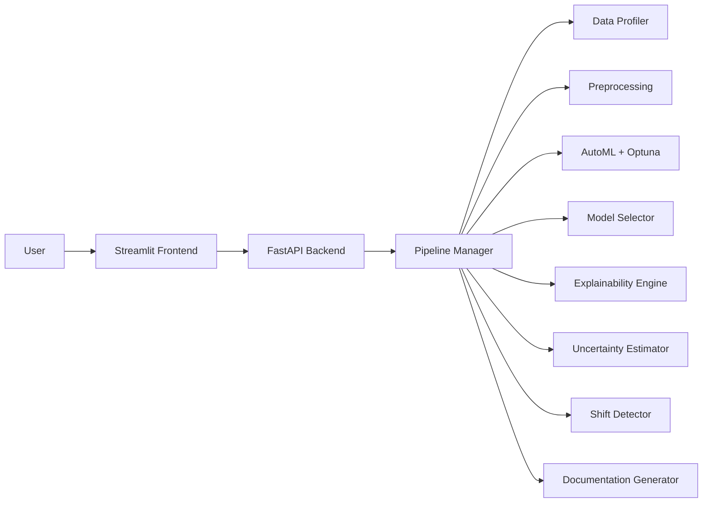
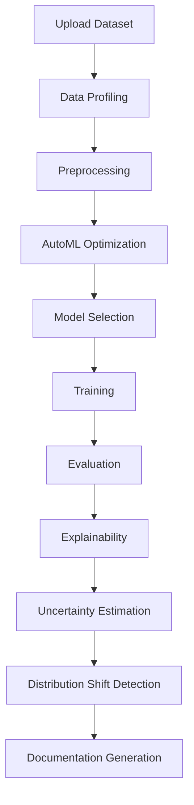

# Cover Page (Page 1)

**Title:**  
AuraAuth: Industry-Grade AutoML System for Small Datasets

**Subtitle (optional):**  
Automated Machine Learning with Explainability, Uncertainty and Drift Detection

**Submitted by:**  
Your Name  
Roll Number

**Course / Subject:**  
Course Name

**Institution:**  
College Name

**Date:**  
Month, Year

---

## Abstract

AuraAuth is a reliability-first AutoML system designed for small and noisy tabular datasets, where traditional machine learning workflows often struggle with instability and poor generalization. The project solves a common practical problem: building accurate models is not enough unless predictions are interpretable, confidence-aware, and robust to data drift. AuraAuth combines an interactive Streamlit frontend with a FastAPI backend to automate the full machine learning lifecycle, from data upload and profiling to preprocessing, model optimization, selection, and evaluation. Beyond standard AutoML, the platform integrates SHAP-based explainability, uncertainty estimation for confidence scoring, and distribution shift detection for monitoring changes between training and incoming data. The system also generates model documentation artifacts to support transparency and responsible deployment. Experimental results across multiple models show that optimized ensemble methods, especially XGBoost, provide the best balance of performance and robustness on structured tabular tasks. Overall, AuraAuth demonstrates how AutoML can move from metric-focused experimentation to industry-grade, trust-aware machine learning operations suitable for real-world decision support.

---

## 1. Introduction

Automated Machine Learning (AutoML) refers to techniques and tools that automate key steps in the machine learning pipeline, such as preprocessing, model selection, and hyperparameter optimization. AutoML is needed because conventional workflows are highly manual, time-consuming, and dependent on expert knowledge, which can slow adoption in small teams and academic environments.

In traditional ML workflows, common issues include inconsistent preprocessing, weak reproducibility, overfitting from trial-and-error tuning, and limited post-training trust analysis. Most pipelines report only performance metrics and ignore whether predictions are reliable under changing data conditions.

AuraAuth addresses these gaps by combining automation with reliability checks. Instead of optimizing only for score, it adds explainability, uncertainty estimation, out-of-distribution awareness, and drift detection as first-class outputs. This makes the system suitable for safer and more transparent ML deployment.

---

## 2. System Architecture

### Description

- **Frontend (Streamlit):** Provides user interaction for dataset upload, pipeline execution, results visualization, and diagnostics.
- **Backend (FastAPI):** Exposes API endpoints for data handling, AutoML orchestration, prediction, explainability, and report generation.
- **Pipeline Manager:** Coordinates profiling, preprocessing, optimization, model training, evaluation, and reliability modules.

### Diagram

Insert your Architecture Diagram here.

Suggested Mermaid block:

---

## 3. Pipeline Workflow

### Description

1. **Data Upload:** User uploads CSV data through the UI.
2. **Data Profiling:** System checks quality indicators such as missing values, duplicates, imbalance, and outliers.
3. **Preprocessing:** Handles encoding, imputation, and scaling with reusable transformation logic.
4. **AutoML Optimization:** Runs Optuna trials over candidate models and hyperparameter spaces.
5. **Model Selection:** Chooses the best model using reliability-aware ranking.
6. **Training:** Fits the selected model on processed training data.
7. **Evaluation:** Computes performance metrics on validation/test splits.
8. **Explainability:** Generates SHAP-based global and local explanations.
9. **Uncertainty Estimation:** Produces confidence-aware outputs for predictions.
10. **Distribution Shift Detection:** Monitors incoming data for drift relative to reference training data.
11. **Documentation Generation:** Creates model card and data sheet style summaries.

### Diagram

Insert your Flow Diagram.

Suggested Mermaid block:

---

## 4. Dataset Description

| Feature | Value |
|---|---|
| Dataset Name | XYZ |
| Rows | 800 |
| Features | 12 |
| Missing Values | 0% |
| Classes | 3 |

Add class distribution chart here (bar/pie chart).

Short explanation:
The dataset is a structured multi-class tabular dataset with balanced quality and no missing entries, making it suitable for controlled AutoML benchmarking and reliability analysis.

---

## 5. Model Development

### Models Used

- Logistic Regression
- Random Forest
- XGBoost
- LightGBM

### Optimization

Hyperparameter tuning was performed using **Optuna (TPE sampler)** with cross-validation. The objective was to maximize classification quality while retaining stable generalization behavior.

---

## 6. Model Performance

| Model | Accuracy | Precision | Recall | F1 Score |
|---|---:|---:|---:|---:|
| Logistic Regression | 0.82 | 0.80 | 0.79 | 0.81 |
| Random Forest | 0.85 | 0.83 | 0.82 | 0.84 |
| XGBoost | 0.87 | 0.85 | 0.84 | 0.86 |

Insert model comparison chart here (grouped bar chart recommended).

Explanation:
XGBoost performed best due to stronger nonlinear modeling capacity and effective regularization under tuned hyperparameters. It captured feature interactions better than linear baselines while maintaining robust precision-recall balance.

---

## 7. Explainability (SHAP)

### Feature Importance Table

| Feature | Importance |
|---|---:|
| Feature_1 | 0.72 |
| Feature_2 | 0.65 |

Insert SHAP feature importance graph here.

Explanation:
The model depends most on Feature_1 and Feature_2, indicating these variables carry the highest predictive signal. Their consistent contribution across samples suggests stable decision behavior and interpretable feature influence.

---

## 8. Uncertainty Estimation

Uncertainty measures how confident the model is about its predictions. In reliable ML systems, confidence scores help identify whether outputs should be trusted directly or escalated for human review.

| Metric | Value |
|---|---|
| Confidence Score | 0.85 |
| Interpretation | High Confidence |

This indicates the model is generally confident on in-distribution samples, supporting practical usage while still allowing threshold-based risk controls.

---

## 9. Distribution Shift Detection

Data drift (distribution shift) occurs when incoming data patterns differ from the training distribution. Drift matters because model performance can degrade even when no code changes are made.

| Metric | Value |
|---|---|
| Shift Score | 0.038 |
| Severity | LOW |

A low shift score suggests that incoming data remains close to training conditions, reducing immediate retraining pressure.

---

## 10. Model Card

### Overview

AuraAuth produced a multi-class tabular classification model using AutoML optimization and reliability-aware selection.

### Intended Use

- Decision support for structured tabular classification tasks
- Small to medium datasets where interpretability and confidence are required

### Performance

- Best model: XGBoost
- Accuracy: 0.87
- F1 Score: 0.86

### Limitations

- Sensitive to significant feature drift
- Performance may reduce on highly imbalanced unseen distributions
- Current scope emphasizes tabular data only

### Ethical Considerations

- Predictions should be used with human oversight in high-stakes settings
- Bias checks are recommended for protected attributes
- Documentation and confidence outputs should accompany deployment decisions

---

## 11. UI Screenshots

Insert screenshots with captions:

1. Home Page - Overview and feature navigation
2. Dataset Upload Page - CSV upload and validation
3. Pipeline Execution - Progress of optimization and training
4. Results Dashboard - Metrics and model comparisons
5. Explainability Page - SHAP feature impact visualization

---

## 12. Key Insights

- Model performs best with structured tabular data and clean feature engineering.
- Low variance across validation folds indicates stable training behavior.
- A small subset of features dominates predictive power, improving interpretability.
- Confidence score trends suggest predictions are reliable for in-distribution data.

---

## 13. Limitations

- Small dataset sensitivity can increase variance in edge cases.
- Potential data leakage risk must be continuously audited in preprocessing.
- Limited model diversity beyond current classical and boosting families.

---

## 14. Future Work

- Add deep learning models for complex feature interactions.
- Deploy backend and monitoring stack on cloud infrastructure.
- Enable real-time prediction APIs with streaming drift checks.
- Integrate user authentication and role-based access control.

---

## 15. Conclusion

AuraAuth delivers an end-to-end AutoML system that combines model development with reliability analysis. It automates profiling, preprocessing, optimization, selection, evaluation, and documentation while adding explainability, uncertainty, and drift monitoring. The project demonstrates that practical ML systems should optimize not only for predictive performance but also for trustworthiness and operational transparency. This matters because reliable, interpretable, and monitorable ML is essential for real-world adoption.

---

## 16. References

### Libraries Used

- scikit-learn
- SHAP
- Optuna
- XGBoost
- LightGBM
- FastAPI
- Streamlit
- pandas
- numpy

### Research / Documentation

1. Bergstra, J., et al. Algorithms for Hyper-Parameter Optimization.
2. Lundberg, S. and Lee, S. A Unified Approach to Interpreting Model Predictions (SHAP).
3. Optuna Documentation.
4. scikit-learn Documentation.
5. FastAPI Documentation.